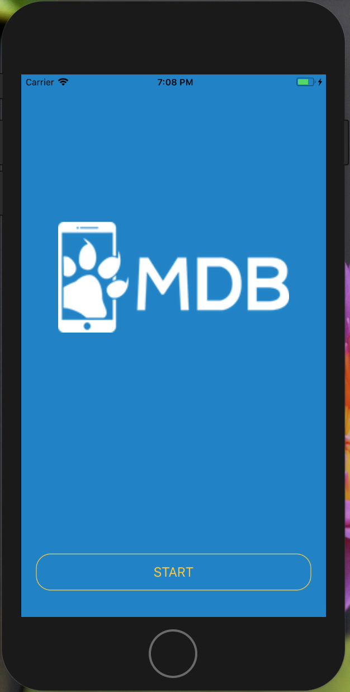
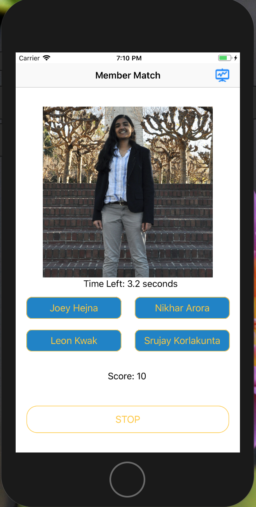
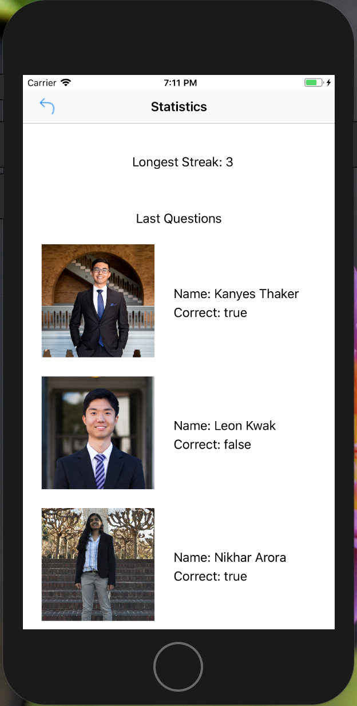

# Match The Member
MDB Mini Project 1

# App Purpose
The purpose of this app is to help the new members get to know the members of MDB. Since there are a lot of members, it's hard to remember everyone's names, but Match the Member offers a fun, interactive way of learning all the names

# Main Menu
This is the Start screen. From this screen you can click the Start button to begin playing the game.

# Game Screen
This is where the fun happens! An image will appear on the screen with four name options below. You have 5 seconds to guess the name of the person on the screen before time runs out. Your countdown clock will appear below the image. In addition, a score count is available underneath the answer buttons to see the tally of you score since hitting Start. If at any time you are ready to quit play, you can hit the Stop button at the bottom of the screen to reset the game and return back to the Main Menu. In addition, there are statistics available when clicking the statistic icon in the top right corner of the screen.

Features:
- 5 second countdown clock for each image on the screen
- 1 second break between each concurrent question
- Answer feedback - if you click the correct answer, the button will appear green; however, if you answer incorrectly or run out of time, the correct answer will appear green and the incorrect answer will appear red
- Score Tally - a total count of the number of correct answers

# Statistics
This screen displays the longest streak up until this point during the game. In addition, it displays the last three questions you answered and whether you answered correctly. If at any time you wish to return back to the game screen, click the back arrow at the top left corner of the screen.

